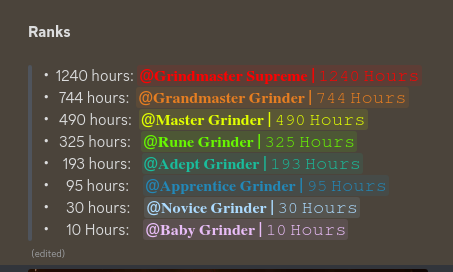
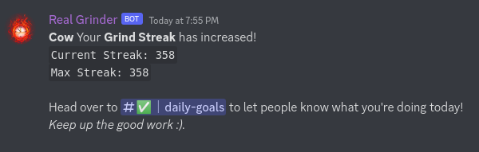
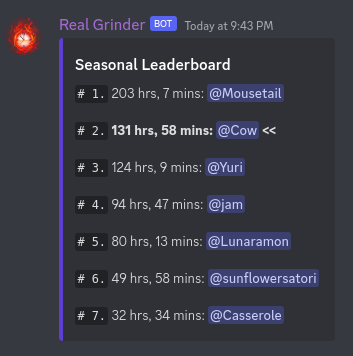
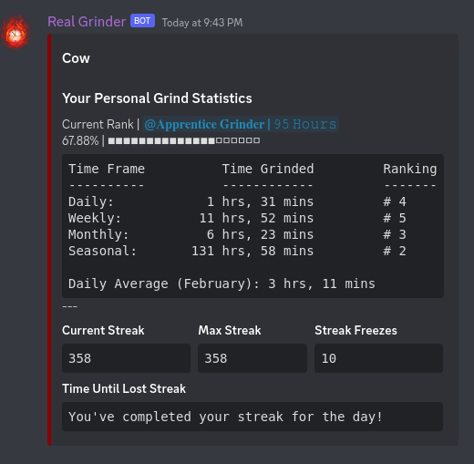
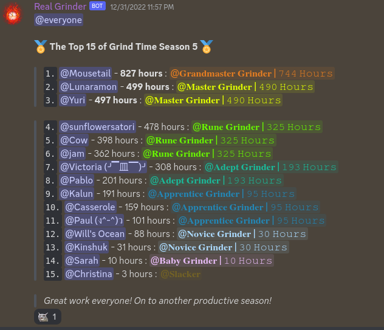
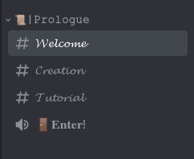
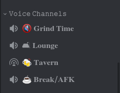

<h1 align='center'>📚 Study Bot</h1>

<h4 align='center'>A discord bot that gamifies studying by ranking your study hours against friends, displaying leaderboards, and giving you unique ranks based on how many hours you've studied and much more!</h4>

 

- I made a [youtube video](https://youtu.be/mvplUjRQPqw) on this project
- [Join the server](https://discord.gg/QxeTD6V86F) here!
- Check out my other projects [here](https://davidcao.xyz)!
- P.S. The code in this project is a mess, I am in the process of refactoring it [here](https://github.com/dave-cao/Grind-Bot)

<!-- ABOUT THE PROJECT -->
## About The Project

Because of the quarantine and the growing popularity of online learning, I found myself lonely and unmotivated to study. Therefore, I decided to create a studying community known as **Grind Time**. With that, different ideas started to pop into my head on not only how to motivate myself but motivate others to study.

1. It began with a **levelling system** where the more hours you study in the *Grind Time* voice channel, the higher your level / rank.
    - incentivizing focused studying
    - 
2. Then came the **streak system** where each day you study, you increase your streak. However, you have to be in the voice channel for at least 12 minutes for it to update.
    - incentivizing consistency
    - 
3. Next came the **leaderboards**. You could now pit yourself against others in the server. See your rank and hours studied compared to others!
    - 
5. Then popped the **grind profile**. A profile which displays your rank, hours studied, streaks, etc. all into one neat profile card individualized for each member.
    - 
7. Finally, I decided to implement **automated leaderboard posts** where each week, month, and season, the top 20 members of the server gets recognized for their achievements.
    - 

### Built With

Javascript, Discord.js, Node

<!-- USAGE EXAMPLES -->
## Usage - [Join the server](https://discord.gg/QxeTD6V86F)

1. When you first join, you're presented with 4 channels. Click on the `Enter!` channel to unlock the server
    - 

2. Enter `Grind Time` to start tracking your hours!
    - 

3. That's pretty much it. You can explore the server, but everything else is pretty much automated! Don't be shy to talk or ask me anything. I'm there everyday!

_For a more comprehensive example of using this application, refer to this [video](https://youtu.be/mvplUjRQPqw)_

### File Explanations - Skip if not interested
- `index.js` contains the main bulk of the functionality. It houses the time tracker, streaks, and role adding / removing. 
- `scheduled/` contains different files that are run at certain time intervals
    - `daily-instrucions.js`: will post daily instructions in different channels in case members forget commands
    - `monthly-leaderboard.js`: will post the top 20 grinders and their hours at the end of each month
    - `weekly-leaderboard.js`: will post the top 20 grinders and their hours at the end of each week
    - `seasonal/seasonal-leaderboard.js`: will post the top 20 grinders and their hours at the end of each season 
    - `QOTD/QOTD.js`: each day, it will post a question and quote of the day.

<!-- ROADMAP -->
## Roadmap

I have a lot of ideas for this project, gamifying it even more, however this is the current finished build. Currently I am studying Python, and since the project is mainly in Javascript, I will revisit this project once I go back to learning Javascript.

- Some Future Ideas:
    1. Making a shop
    2. Making a story that unlocks after each rank
    3. Hidden ranks / special classes
    4. Making your own character

<!-- CONTRIBUTING -->
## Contributing

Contributions are what make the open source community such an amazing place to learn, inspire, and create. Any contributions you make are **greatly appreciated**.

If you have a suggestion that would make this better, please fork the repo and create a pull request. You can also simply open an issue with the tag "enhancement".
Don't forget to give the project a star! Thanks again!

1. Fork the Project
2. Create your Feature Branch (`git checkout -b feature/AmazingFeature`)
3. Commit your Changes (`git commit -m 'Add some AmazingFeature'`)
4. Push to the Branch (`git push origin feature/AmazingFeature`)
5. Open a Pull Request

<!-- CONTACT -->
## Contact

#### David Cao
- Email: sirdavidcao@gmail.com
- [Youtube](https://www.youtube.com/channel/UCEnBPbnNnqhQIIhW1uLXrLA)
- [Linkedin](https://www.linkedin.com/in/david-cao99/)
- Personal Website: https://davidcao.xyz/
- Project Link - https://github.com/dave-cao/[Study-Bot]

